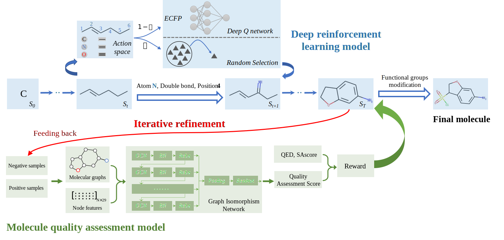

# QADD
Source code for the paper:  ***De Novo* Drug Design by Iterative Multi-Objective Deep Reinforcement Learning with graph-based Molecular Quality Assessment**


## Overview

Generating molecules of high quality and drug-likeness in the vast chemical space is a big challenge in the drug discovery. Most existing generating methods focus on diversity and novelty of molecules, but ignoring the drug potentials of the generated molecules during the generation process. In this study, we present
a novel *de novo* multi-objective quality assessment-based drug design approach QADD, which integrates an iterative refinement framework with a novel graph-based molecule quality assessment model for drug potentials. QADD designs a multi-objective deep reinforcement learning pipeline to generate molecules with multiple desired properties iteratively, where a graph neural network-based model for accurate molecular quality assessment on drug potentials is introduced to guide molecule generation. 




## Dependency

- python3.7
- torch 1.8.1
- skearn 0.21.3
- numpy 1.20.1
- dgl 0.6.1
- baselines


## Pipeline

For the molecular quality assessment (QA) model (in the 'QA/' folder)

1. convert SMILES strings to graph by generating "graph.bin" file

   ```bash
   python dataQA.py 
   ```

2. train the QA model

   ```bash
   python trainQA.py
   ```

3. predict

   ```
   python predictQA.py
   ```


For the deep reinforcement learning (RL) model (in the 'RL/' folder)

```
python run_RL.py
```


For the iterative refinement: retrained QA model every 5000 episode


## Contact

- [fy826943194@sjtu.edu.cn](mailto:fy826943194@sjtu.edu.cn)


